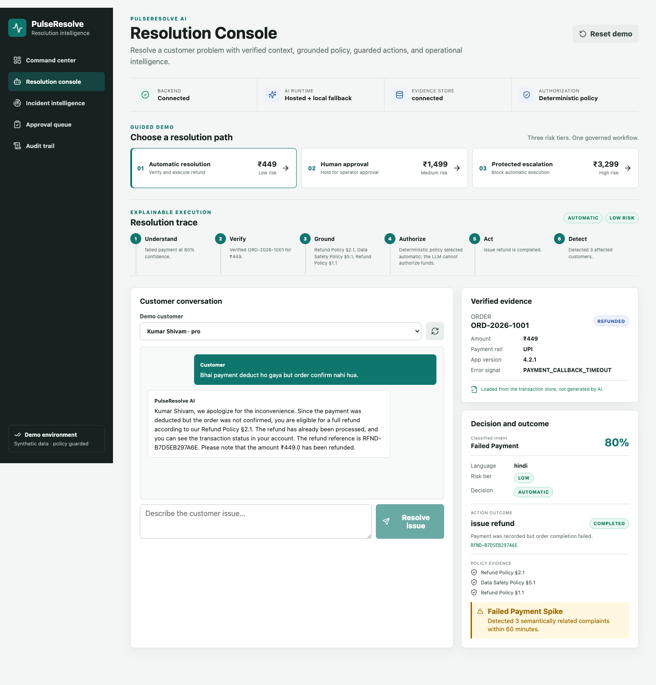

# PulseResolve AI

PulseResolve is an **incident-aware customer resolution platform**. It moves a
support request from conversation to verified evidence, grounded policy,
guarded action, incident detection, and audit history in one explainable
workflow.

The repository is intentionally structured for readability. Domain rules do
not depend on FastAPI, SQLAlchemy, HTTP clients, or a particular AI provider.



## Why it is different

Most support bots stop after generating an answer. PulseResolve can safely act
on verified business context and recognize when several individual complaints
are symptoms of one operational failure. The LLM classifies and communicates;
deterministic policy remains responsible for monetary authorization.

## What is included

- Customer chat with English/Hinglish issue classification
- Policy retrieval using embeddings
- Automatic refund for eligible transactions up to ₹500
- Approval workflow for refunds from ₹500 to ₹2,000
- Human-review workflow above ₹2,000
- Six-stage explainability trace from understanding to incident detection
- Idempotency protection against duplicate refunds
- Hybrid incident detection using semantic similarity and shared error signals
- Evidence-based probable root-cause summary
- Incident investigation and resolution workflow
- Operations dashboard, approvals page, incidents page, and audit trail
- One-click restoration of the complete synthetic demonstration dataset
- Deterministic local AI mode requiring no API key
- Optional OpenAI-compatible chatbot with automatic local fallback
- SQLite development mode and PostgreSQL Docker mode
- Backend, evaluation, frontend, and browser workflow verification

## FlowZint submission fit

PulseResolve AI is positioned for the **Customer Care Bot** category. It solves
failed-payment support workflows by combining conversational AI, verified
transaction context, deterministic policy rules, safe refund automation, human
approval, incident detection, and auditability.

See [docs/SUBMISSION.md](docs/SUBMISSION.md) for the competition-ready problem
statement, demo script, AI features, and final submission checklist.

## Architecture

```text
Browser / Next.js
       |
       v
FastAPI controllers
       |
       v
Application services
  - ChatOrchestrator
  - ActionWorkflowService
  - IncidentDetectionService
  - DemoResetService
  - QueryService
       |
       v
Domain entities + ports + deterministic rules
       ^
       |
Infrastructure adapters
  - SQLAlchemy repositories / Unit of Work
  - Local or remote AI provider
  - Mock refund gateway
```

Read [docs/LLD.md](docs/LLD.md) for the component-level design and SOLID
mapping.

## Quick start with Docker

Requirements: Docker Desktop or Docker Engine with Docker Compose.

```bash
cp .env.example .env
docker compose up --build
```

Open:

- Web application: http://localhost:3000
- API documentation: http://localhost:8000/docs
- Health endpoint: http://localhost:8000/health

The Docker setup uses PostgreSQL. The first API startup creates the schema and
seeds demonstration data.

## Quick start without Docker

Requirements:

- Python 3.11+
- Node.js 22+
- npm

Terminal 1:

```bash
cd backend
python -m venv .venv
source .venv/bin/activate  # Windows: .venv\Scripts\activate
pip install -e ".[dev]"
uvicorn app.main:app --reload --port 8000
```

Terminal 2:

```bash
cd frontend
npm install
npm run dev
```

The local backend defaults to SQLite and creates `backend/pulseresolve.db`.

## Demonstration flow

### Automatic refund and incident detection

1. Open **Resolution Console** and select **Automatic resolution**.
2. Select **Kumar Shivam**.
3. Send the pre-filled Hinglish message:
   `Bhai payment deduct ho gaya but order confirm nahi hua.`
4. The application:
   - classifies the complaint;
   - retrieves relevant policy sections;
   - verifies the ₹449 transaction;
   - applies the deterministic refund policy;
   - completes a mock refund;
   - detects the third related failed-payment complaint;
   - creates an incident with shared error, app-version, and payment evidence.
5. Open **Incident Intelligence**, begin investigation, and inspect the
   human-readable **Audit Trail**.

### Human approval

1. Select **Human approval** in the Resolution Console.
2. Send:
   `UPI charged me but the order was not created.`
3. The ₹1,499 refund enters `awaiting_approval`.
4. Open **Approval Queue**, review the evidence, and approve or reject it.

### High-value review

1. Select **Protected escalation** in the Resolution Console.
2. Send:
   `Payment ho gaya lekin booking confirm nahi hui.`
3. The ₹3,299 request remains blocked for explicit human review.

> All money movement is simulated through `MockRefundGateway`. No real payment
> provider is contacted.

## AI modes

### Local mode (default)

```env
AI_PROVIDER=local
```

This mode uses:

- a deterministic, readable complaint analyzer;
- a local hashing-vector embedding implementation;
- a deterministic grounded response generator.

It is ideal for demos, tests, offline development, and predictable judging.

### OpenAI-compatible mode

The backend can use any provider that exposes OpenAI-compatible
`/chat/completions`. Keep `EMBEDDING_MODEL=local` when using a free chat API
that does not provide compatible embeddings.

Groq free API key:

```env
AI_PROVIDER=openai_compatible
CHATBOT_API_BASE_URL=https://api.groq.com/openai/v1
CHATBOT_API_KEY=your_groq_key
CHATBOT_MODEL=llama-3.1-8b-instant
EMBEDDING_MODEL=local
```

Google Gemini API key:

```env
AI_PROVIDER=openai_compatible
CHATBOT_API_BASE_URL=https://generativelanguage.googleapis.com/v1beta/openai
CHATBOT_API_KEY=your_gemini_key
CHATBOT_MODEL=gemini-3.5-flash
EMBEDDING_MODEL=local
```

OpenRouter free models:

```env
AI_PROVIDER=openai_compatible
CHATBOT_API_BASE_URL=https://openrouter.ai/api/v1
CHATBOT_API_KEY=your_openrouter_key
CHATBOT_MODEL=openrouter/free
EMBEDDING_MODEL=local
```

The legacy `LLM_BASE_URL`, `LLM_API_KEY`, and `LLM_MODEL` names are also
supported. Provider-specific changes remain inside
`backend/app/infrastructure/ai`.

Hosted chatbot failures, invalid structured responses, and free-tier rate
limits fall back to the deterministic local analyzer and answer generator. The
demo therefore remains usable without a paid or continuously available API.

## Configuration

| Variable | Default | Purpose |
|---|---:|---|
| `DATABASE_URL` | SQLite URL | Async SQLAlchemy connection |
| `CORS_ORIGINS` | Localhost and 127.0.0.1 | Allowed frontend origins |
| `AI_PROVIDER` | `local` | `local` or `openai_compatible` |
| `CHATBOT_API_BASE_URL` | OpenAI URL | OpenAI-compatible `/v1` base URL |
| `CHATBOT_API_KEY` | empty | Hosted chatbot provider key |
| `CHATBOT_MODEL` | OpenAI model | Hosted or local chatbot model |
| `DEMO_MODE` | `true` | Enables synthetic-data reset endpoint |
| `AUTO_REFUND_LIMIT` | `500` | Highest automatic refund amount |
| `APPROVAL_REFUND_LIMIT` | `2000` | Highest normal approval amount |
| `INCIDENT_SIMILARITY_THRESHOLD` | `0.68` | Complaint similarity cutoff |
| `INCIDENT_MIN_COMPLAINTS` | `3` | Complaints needed for an incident |
| `INCIDENT_WINDOW_MINUTES` | `60` | Detection lookback window |

## Quality checks

From the repository root:

```bash
make test
make lint
```

Or run individually:

```bash
cd backend
pytest -q
ruff check app tests eval
ruff format --check app tests

cd ../frontend
npm run typecheck
npm run lint
npm run build
npm run test:e2e  # requires the local API and web servers
```

## Repository map

```text
pulseresolve-ai/
├── backend/
│   ├── app/
│   │   ├── api/              # HTTP controllers and composition
│   │   ├── application/      # Use cases and orchestration
│   │   ├── core/             # Configuration and logging
│   │   ├── domain/           # Entities, enums, ports, exceptions
│   │   └── infrastructure/   # DB, AI, and gateway adapters
│   └── tests/
├── frontend/
│   ├── app/                  # Next.js App Router pages
│   ├── components/           # Typed, focused UI components
│   └── lib/                  # API client and shared types
├── docs/
├── .github/workflows/ci.yml
├── docker-compose.yml
└── Makefile
```

## Future roadmap

PulseResolve AI is complete for a hackathon demo. The next phase is to turn the
reference implementation into a production-ready customer-operations platform
through the following work:

- **Access control:** add identity-provider integration, role-based permissions,
  and separate views for support agents, approvers, and operations leads.
- **Payment integration:** replace the mock refund gateway with verified
  payment-provider webhooks, request signatures, reconciliation jobs, and secure
  secrets handling.
- **Operational reliability:** move schema creation to migrations, add
  queue-backed retries, and use an outbox pattern for refund, approval, and
  incident events.
- **Responsible AI controls:** add provider-specific structured-output
  validation, prompt/version tracking, confidence thresholds, and escalation
  rules for low-certainty responses.
- **Privacy and compliance:** implement PII redaction, retention policies,
  audit-log export, data-access controls, and a formal security review.
- **Observability:** add metrics, tracing, alerting, backups, and disaster
  recovery runbooks for production support.
- **Product expansion:** connect real CRM/order systems, enrich incident
  evidence with service logs, and add SLA tracking for unresolved customer
  issues.

See [docs/SECURITY.md](docs/SECURITY.md).

## License

MIT. See [LICENSE](LICENSE).
